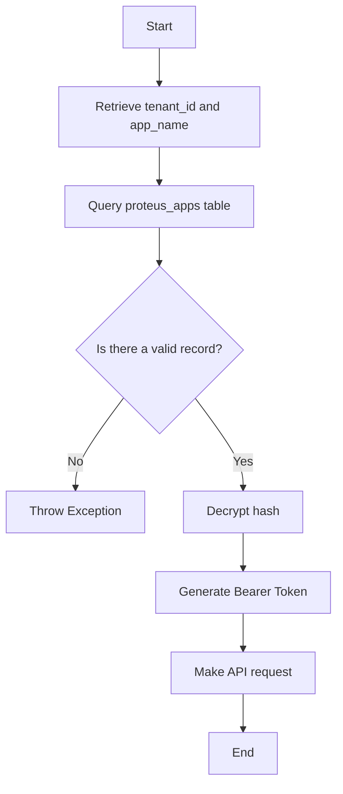

# Proteus Client for Laravel

A professional PHP client library for integrating Proteus API functionality into Laravel applications (version 11.0 and above).

## Overview

This package provides a comprehensive interface for interacting with the Proteus API, offering seamless integration with Laravel's service container architecture. The library includes a service class (`Proteus`), a dedicated Service Provider, and a Facade for simplified access to media management, metadata operations, category handling, and media transformation capabilities.

## Installation

### System Requirements

Ensure your development environment meets the following prerequisites before proceeding with the installation:

- **PHP**: Version 8.0 or higher
- **Laravel Framework**: Version 11.0 or 12.0
- **Composer**: Dependency management tool
- **Proteus API Access**: Valid API endpoint URL and authentication token

### Step 1: Package Installation

Install the package via Composer by executing the following command in your Laravel project root directory:

```bash
composer require ometra/proteus-client
```

### Step 2: Service Provider Registration

The `ProteusServiceProvider` will be automatically registered by Laravel's package auto-discovery mechanism, as configured in the package's `composer.json` manifest. Manual registration is not required under normal circumstances.

If auto-discovery has been disabled in your application, you may register the provider manually by adding it to the `providers` array in `config/app.php`:

```php
'providers' => [
    // ...
    Ometra\Apollo\Proteus\Providers\ProteusServiceProvider::class,
],
```

### Step 3: Configuration File Publishing

Publish the package configuration file to enable customization of API endpoints and authentication credentials:

```bash
php artisan vendor:publish --tag=proteus-config
```

This command will generate a `config/proteus.php` file in your Laravel application's configuration directory, containing the package's default configuration values.

### Step 4: Environment Variables

```dotenv
PROTEUS_URL=https://your-proteus-api.example.com
PROTEUS_APP_NAME=my_app
```

Notes:
- `PROTEUS_URL` is the Proteus API base URL.
- `PROTEUS_APP_NAME` is the app name used to resolve credentials.
- `APP_NAME` is used as fallback when `PROTEUS_APP_NAME` is missing.
- `PROTEUS_TOKEN` is still present in `config/proteus.php` for compatibility, but it is not used by the current `Proteus` constructor flow.

### Step 4: Create App Credentials
Before using the client at runtime, you must create a record in `proteus_apps` with your `tenant_id` and API token.

Run:

```bash
php artisan proteus:app:store
```

You can also provide options directly:

```bash
PROTEUS_APP_NAME="my_app" php artisan proteus:app:store --tenant_id=1 --token="your_plain_token"
```

Notes:
- The command asks for `tenant_id` and `token` when not provided.
- App name is read from `PROTEUS_APP_NAME` (fallback `APP_NAME`).
- The token is encrypted and stored in `proteus_apps.hash`.

### Step 5: Configuration Verification (Optional)

The `config/proteus.php` file published in Step 3 contains the following configuration options:

- **url**: Base URL for the Proteus API (sourced from `PROTEUS_URL` environment variable)
- **token**: Bearer token for API authentication (sourced from `PROTEUS_TOKEN` environment variable)
- **transformations**: Available transformation presets for media processing operations
- **formats**: Supported output format specifications

You may customize these configuration options to meet your specific requirements by editing the `config/proteus.php` file directly.

### Step 6: Configuration Cache Management (Optional)

If your Laravel application has configuration caching enabled, clear the cache to ensure the new settings are loaded:

```bash
php artisan config:clear
```

The installation and configuration process is now complete. The Proteus client is ready for use in your Laravel application.


### Authentication Flow

The `Ometra\Apollo\Proteus\Proteus` client resolves authentication as follows:



### Middleware Context (`proteus.context`)

The `ProteusServiceProvider` registers the `proteus.context` middleware alias.

`tenant_id` resolution order:
1. `X-Tenant-ID` header
2. `tenant_id` query parameter
3. `tenant_id` request attribute
4. `config('bee-hive.resolver')` (if configured and available)

`app_name` resolution order:
1. `PROTEUS_APP_NAME`
2. `APP_NAME`
3. `default_app`

Example route usage:

```php
Route::middleware('proteus.context')->group(function () {
    Route::get('/media', [MediaController::class, 'index']);
});
```

## Usage

The Proteus client can be accessed through two primary methods: dependency injection or the Facade pattern.

### Using the Facade

```php
use Ometra\Apollo\Proteus\Facades\Proteus;

// Retrieve paginated media list
$media = Proteus::mediaIndex([
    'page' => 1,
    'per_page' => 20,
]);

// Retrieve specific media details
$item = Proteus::mediaShow('media-id');
```

### Using Dependency Injection

```php
use Ometra\Apollo\Proteus\Proteus;

class MediaController
{
    public function index(Proteus $proteus)
    {
        $media = $proteus->mediaIndex(['page' => 1]);

        return view('media.index', compact('media'));
    }
}
```

## File Upload Operations

The `uploadFile` method facilitates the transmission of files and associated metadata to designated API endpoints:

```php
use Ometra\Apollo\Proteus\Facades\Proteus;

$data = [
    'files' => [$request->file('file')], // UploadedFile[]
    'metadata' => [
        'title' => 'Mi archivo',
    ],
    'transformations' => [
        'thumbnail' => ['key' => 'thumb_preset'],
    ],
];

$response = Proteus::uploadFile('media/store', $data);
```

## File Download Operations

To download media resources as a `StreamedResponse`:

```php
use Ometra\Apollo\Proteus\Facades\Proteus;

return Proteus::mediaDownload('media-id', 'mp4');
```

Alternatively, media files can be persisted directly to the Laravel configured storage system:

```php
use Ometra\Apollo\Proteus\Facades\Proteus;

Proteus::saveMediaLocal('media-id', 'mi-archivo.mp4');
```

## Metadata and Category Management

### Retrieve All Categories

```php
$categories = Proteus::categoriesIndex();
```

### Retrieve Metadata Definition by Key

```php
$definition = Proteus::metadataKeys('genre');
```

### Retrieve Possible Values for Metadata Key

```php
$values = Proteus::metadataValuesFormKey('genre');
```

## Advanced Configuration

The client provides methods to retrieve transformation and format configuration settings programmatically:

```php
use Ometra\Apollo\Proteus\Facades\Proteus;

// Retrieve available transformation configurations
$transformations = Proteus::transformationsConfig();

// Retrieve supported format specifications
$formats = Proteus::formatsConfig();
```

## License

This package is distributed under the MIT License. See the LICENSE file for complete terms and conditions.
